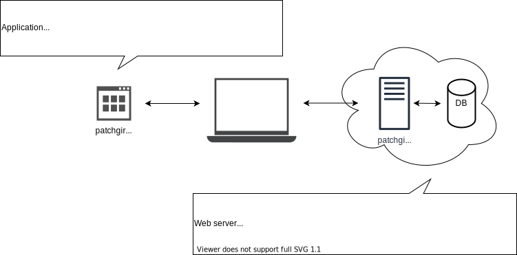

# PatchGirl

[](https://travis-ci.com/patchgirl/patchgirl)
[](https://github.com/patchgirl/patchgirl/actions)

A postman/postwoman like, web app to test your APIs !

## How to use

To use PatchGirl, you only need to go to the [app page 🚀](https://patchgirl.io).
If you want to make request to an API running on your computer (e.g: localhost), you need to run the [patchgirl-runner app](https://github.com/patchgirl/patchgirl/releases).
Running the **patchgirl-runner** app is simple, just download it and execute it in a terminal like so:

```bash
chmod +x patchgirl-runner-X.Y.Z-yourOS
./patchgirl-runner-X.Y.Z-yourOS
```

nb: Please note that recent version of MacOS will display an error popup stating that the app hasn't been recognized and so is insecure.
To overcome this issue, you'll need to "right-click open" the executable from the finder once!

### Windows

Windows support is currently on the roadmap.

## Features

✅: available<br/>
🔧: in development<br/>
📝: in the roadmap<br/>

| available | feature                              | description                                                                                                                                   |
|-----------|--------------------------------------|-----------------------------------------------------------------------------------------------------------------------------------------------|
| ✅        | sign in via github                   | save your data with a Github account                                                                                                          |
| ✅        | environment                          | Environment helps you save and reuse variables                                                                                                |
| ✅        | http request                         | Create and play http requests                                                                                                                 |
| ✅        | Postgres SQL query                   | Create and play Postgres SQL queries                                                                                                          |
| ✅        | scenarios                            | Create and Play multiple http requests or postgresql queries one after another                                                                |
| ✅        | pre request script                   | Play a script right before executing a request (eg: Include timestamp in the request headers, send a random string in the URL parameters,...) |
| ✅        | post request script                  | Play a script right after executing a request (eg: Assign the response result to a variable, assert that the response status is a 200,...)    |
| ✅        | desktop app (Linux & MacOS only as of today) | Lightweight desktop proxy so you can play a request targeting a local host                                                                    |
| 🔧        | cross platform desktop application   | Make the PatchGirl desktop app available on Windows (currently only available on Linux and MacOS                                         |
| 🔧        | MySql request                        | Play MySQL queries                                                                                                                            |
| 📝        | websocket                            |                                                                                                                                               |
| 📝        | MongoDB queries                      |                                                                                                                                               |
| 📝        | Kafka queries                        |                                                                                                                                               |
| 📝        | RabbitMQ queries                     |                                                                                                                                               |
| 📝        | Shell/Bash queries                   |                                                                                                                                               |
| 📝        | websocket                            |                                                                                                                                               |
| 📝        | server send events                   |                                                                                                                                               |
| 📝        | API documentation                    | Generate documentation from a set of requests                                                                                                 |
| 📝        | Team mode                            | Share your collections with your team                                                                                                         |
| 📝        | Keyboard shortcuts                   |                                                                                                                                               |


📢 Scenario of tests

Play multiple requests one after another. This is useful if you want to:
- Automate your development environment db (eg: create many users,...)
- Automate the test of your API (eg: create a user then show it then delete it)

📜 pre-request script

Run a javascript script right before a request is executed. This is useful if you want to:
 - Include timestamp in the request headers
 - Send a random string in the URL parameters

📜 post-request script

Run a javascript script after a request is executed. This is useful if you want to:
 - Assert for a response status or body
 - Set variables according on the response body

📦 Desktop app (AKA *patchgirl runner*)

Install a desktop app so you can use PatchGirl locally. This is needed when you:
- Use PatchGirl without internet access
- Call localhost url
- Need to play any request that is not HTTP (i.e: Postgresql, MySQL,...)
- want faster request execution (no round trips to a remote server, everything is done on your computer)

## How to build

Please refer to the [documentation](/documentation) if you need to build and run PatchGirl locally.

## Architecture



PatchGirl is only built with functional programing languages:
- **NixOS** for the operating system
- **Haskell** for the backend API
- **Elm** for the front end single page app
- **Dhall** for everything related to configuration
